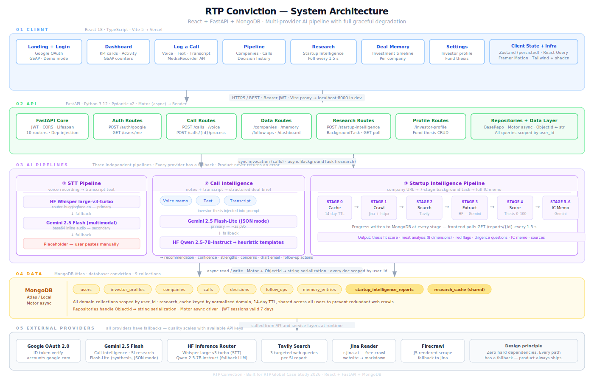

<div align="center">


# RTP Conviction

### The deal intelligence workspace for venture capital.

**Every founder call generates insight. This is where it lives.**

[](https://www.typescriptlang.org/)
[](https://python.org)
[](https://fastapi.tiangolo.com/)
[](https://react.dev)
[](https://mongodb.com/atlas)

[**Live App →**](https://conviction-vc.vercel.app) &nbsp;&nbsp;·&nbsp;&nbsp; [**GitHub →**](https://github.com/Kush172005/Conviction) &nbsp;&nbsp;·&nbsp;&nbsp; [**Architecture Diagram →**](./docs/architecture.svg)

</div>

---

## The problem

A VC team meets 5–15 founders a week. Every call produces a few minutes of real signal — a concern about the cap table, a question about competitive moat, a founder who revealed something under pressure. That signal needs to become institutional memory.

It doesn't.

Three months later, a partner walks into an IC meeting and asks *"why were we even looking at this?"* — and nobody can answer with confidence. The notes are scattered across Notion, Slack, and someone's head. The reasoning behind the decision is gone.

This is not a transcription problem. Recording the call doesn't help — nobody re-watches a 45-minute meeting to find one sentence. The insight needs to be **structured, scored, and retrievable the moment the call ends**.

---

## What Conviction does

Conviction sits between a founder call and a VC team's institutional memory. It accepts brain dumps, voice memos, or uploaded meeting recordings and turns them into structured, permanently retrievable deal intelligence — scored against the fund's own thesis, with a draft IC memo and follow-up actions, ready in under 60 seconds.

For companies you haven't met yet, it does the research: crawl the website, run targeted web searches, extract founders and funding history, score thesis alignment, and generate a full investment brief from a URL alone.

| Capability | Description |
|---|---|
| **Post-Call Brain Dump** | Type notes, record a voice memo, or upload meeting audio right after a founder call. A complete deal brief — recommendation, thesis fit, strengths, concerns, red flags, and a draft email — is ready before you leave the parking lot. |
| **Startup Intelligence** | Enter any company URL. The pipeline researches the company across the web, extracts every relevant signal, and produces an IC-grade report with moat analysis, diligence questions, and a thesis fit score. |
| **Fund Thesis Match Engine** | Every company is scored 0–100 against the investor's own thesis — sector, stage, geography, business model — with written reasoning behind each dimension. Not a black box. |
| **Persistent Deal Memory** | A living timeline per company. Every call, decision, concern, and milestone, permanently on record. Three months later you know exactly where you stood and precisely why. |
| **IC Memo Generation** | From raw notes to a complete IC memo in one step — executive summary, market assessment, moat analysis, risk factors, open diligence questions, and a clear recommendation. |
| **Follow-Up Engine** | Every commitment made on a call is captured automatically. Draft follow-up emails are written, overdue items surface before they slip, nothing falls through. |

---

## Try the demo

The frontend ships with a fully seeded demo workspace — RTP Global's sample pipeline, with real companies, calls, decisions, and memory. Every screen is interactive, no backend required.

```bash
git clone https://github.com/Kush172005/Conviction
cd Conviction
npm install
npm run dev
# → http://localhost:5173
```

Open the landing page and click **View live demo**. You'll get access to Arjun Mehta's deal pipeline at RTP Global — browse the dashboard, open company pages, read through call intelligence reports, explore the startup research on Fampay and Whatnot, review the deal memory timeline.

To run the live AI pipeline against real data, see [Local setup](#local-setup) below.

---

## Architecture

<p align="center">
  
</p>

Five layers, each independently deployable and independently degradable:

1. **Client** — React 18 + Vite SPA. TypeScript end-to-end. Tailwind + shadcn/ui for the design system, Framer Motion + GSAP for transitions. Zustand for persisted client state, TanStack Query for server state. Deployed to Vercel with SPA rewrites.

2. **API** — FastAPI with full async I/O. Ten routers covering auth, users, investor profiles, calls, companies, memory, follow-ups, dashboard, startup intelligence, and health. JWT Bearer on every protected route. Pydantic v2 request/response validation throughout.

3. **AI Pipelines** — Three independent services: STT (voice → transcript), Call Intelligence (notes → deal brief), and Startup Intelligence (URL → IC memo). Each has a primary model, a fallback model, and a deterministic fallback that always produces output. The product never returns an error to the investor.

4. **Data** — MongoDB with Motor (fully async). Nine domain collections plus a shared research cache keyed by normalized domain with a 14-day TTL — a second investor researching the same company reuses the crawl, not a duplicate web search.

5. **External Providers** — Google OAuth, Gemini AI, Hugging Face Inference, Tavily Search, Jina Reader, Firecrawl. Every one is optional. The product runs without API keys via demo mode and heuristic fallbacks; quality improves as keys are added.

---

## How the AI is wired

The deliberate choice was multi-provider with layered fallbacks, not a single-vendor dependency. Different stages have different requirements:

| Stage | Primary | Fallback | Final fallback |
|---|---|---|---|
| Voice transcription | HF Whisper large-v3-turbo | Gemini 2.5 Flash multimodal | User pastes manually |
| Call intelligence | Gemini 2.5 Flash-Lite (JSON) | HF Qwen 2.5-7B-Instruct | Deterministic heuristics |
| SI web research | Gemini 2.5 Flash + Google Search grounding | Gemini 2.5 Flash-Lite corpus | Website-only mode |
| SI corpus extraction | HF Qwen 2.5-7B-Instruct | — | Heuristic baseline |
| SI report synthesis | Gemini 2.5 Flash-Lite | HF Qwen 2.5-7B | Template generation |
| Thesis scoring | Deterministic keyword alignment | — | Always works |
| Website crawl | Jina Reader (free) | httpx + BeautifulSoup | Firecrawl (paid) |
| Web search | Tavily (3 queries max) | — | Skipped, marked partial |

**Why this matters for a VC tool:** investors won't tolerate a product that fails when an AI provider has an outage. Deal memory is only useful if it's always there. So we built for the case where Gemini is down, Hugging Face is rate-limited, and Tavily is slow — and the product still ships a useful brief.

---

## Project layout

```
Conviction/
│
├── src/                                # React frontend
│   ├── pages/                          # Route-level pages
│   │   ├── LandingPage.tsx             # Marketing + demo access
│   │   ├── DashboardPage.tsx           # Portfolio overview + KPIs
│   │   ├── NewCallPage.tsx             # Brain dump / voice memo / meeting recording upload
│   │   ├── CallIntelligencePage.tsx    # Deal brief viewer
│   │   ├── StartupIntelligencePage.tsx # Research + IC memo viewer
│   │   ├── CompaniesPage.tsx           # Pipeline list
│   │   ├── CompanyDetailPage.tsx       # Single company detail
│   │   ├── MemoryPage.tsx              # Deal memory timeline
│   │   └── SettingsPage.tsx            # Investor profile + thesis
│   │
│   ├── components/
│   │   ├── layout/                     # AppShell, Sidebar, BottomNav, DemoBanner
│   │   ├── ui/                         # shadcn/Radix primitives
│   │   ├── motion/                     # FadeIn, TiltCard, MagneticButton, Marquee
│   │   ├── auth/                       # GoogleSignInButton
│   │   └── demo/                       # DemoGate overlay
│   │
│   ├── services/api/                   # Typed REST clients (auth, calls, companies, SI …)
│   ├── store/                          # Zustand — useAuthStore, useUIStore
│   ├── mocks/data.ts                   # Complete seed dataset for demo mode
│   ├── types/                          # TypeScript interfaces (mirror backend schemas)
│   └── App.tsx                         # Router + ProtectedRoute
│
├── backend/
│   └── app/
│       ├── routers/                    # FastAPI route handlers (10 routers)
│       ├── services/
│       │   ├── call_intelligence/      # Post-call pipeline (prompts + orchestration)
│       │   ├── startup_intelligence/   # 7-stage research pipeline
│       │   │   ├── pipeline.py         # Orchestrator + BackgroundTask
│       │   │   ├── crawler.py          # Jina → httpx+BS4 → Firecrawl
│       │   │   ├── searcher.py         # Tavily web search
│       │   │   ├── evidence_builder.py # Heuristic + LLM evidence extraction
│       │   │   ├── thesis_engine.py    # Deterministic thesis scoring (no LLM)
│       │   │   └── report_synthesizer.py # IC memo + report (Gemini → HF → templates)
│       │   ├── llm/                    # Gemini + HF provider abstraction
│       │   └── stt/                    # Whisper + Gemini multimodal transcription
│       ├── repositories/               # Async Motor repos, one per collection
│       ├── models/                     # Pydantic domain models
│       ├── schemas/                    # Request/response DTOs
│       ├── config.py                   # Pydantic-settings from .env
│       ├── db.py                       # Motor client pool
│       ├── db_seed.py                  # RTP Global demo data seed
│       └── main.py                     # FastAPI app + CORS + lifespan
│
├── docs/
│   └── architecture.svg                # System architecture diagram (this file)
│
├── public/
│   └── favicon.svg
│
├── vite.config.ts                      # Dev proxy: /api → localhost:8000
├── vercel.json                         # SPA rewrites for production
└── README.md
```

---

## Tech stack

<table>
<tr>
<td valign="top" width="33%">

**Frontend**
- React 18 + TypeScript 5.5
- Vite 5 (dev server + build)
- Tailwind CSS 3 + shadcn/ui (Radix)
- Framer Motion 11 + GSAP 3
- TanStack React Query 5
- Zustand 4 (persisted state)
- React Router v6
- Recharts 2 (data viz)
- Lucide React (icons)

</td>
<td valign="top" width="33%">

**Backend**
- FastAPI 0.115 + Python 3.12
- Motor 3 (async MongoDB driver)
- Pydantic v2 + pydantic-settings
- python-jose (HS256 JWT)
- google-auth (ID token verification)
- httpx + BeautifulSoup4
- python-multipart (audio upload)
- pytest + pytest-asyncio

</td>
<td valign="top" width="33%">

**AI & External**
- Gemini 2.5 Flash + Flash-Lite
- HF Whisper large-v3-turbo (STT)
- HF Qwen 2.5-7B-Instruct (LLM)
- Tavily (web search)
- Jina Reader (website crawl)
- Firecrawl (JS-rendered scrape)
- Google Identity Services (OAuth)
- MongoDB Atlas (managed DB)

</td>
</tr>
</table>

---

## Local setup

### Frontend only (demo mode — no backend needed)

```bash
npm install
npm run dev
# → http://localhost:5173
# Click "View live demo" on the landing page
```

### Full stack with live AI

**1. Clone and install frontend**
```bash
npm install
```

**2. Set up backend**
```bash
cd backend
python -m venv .venv && source .venv/bin/activate   # Windows: .venv\Scripts\activate
pip install -r requirements.txt
```

**3. Configure environment variables**
```bash
cp backend/.env.example backend/.env
# Edit backend/.env with your values (see table below)
```

**4. Start MongoDB** (local or Atlas connection string in `MONGODB_URI`)

**5. Run backend**
```bash
cd backend
uvicorn app.main:app --reload --port 8000
# → http://localhost:8000/docs (Swagger UI)
```

**6. Run frontend**
```bash
# From project root
npm run dev
# → http://localhost:5173
```

Vite proxies `/api/*` to `localhost:8000` automatically — no CORS configuration needed in development.

**7. Seed realistic demo data (optional)**
```bash
cd backend
python -m app.db_seed
# Creates the RTP Global fund profile, sample companies, calls, decisions, and memory entries
```

---

## Environment variables

### Backend (`backend/.env`)

| Variable | Required | Description |
|---|---|---|
| `MONGODB_URI` | Yes | MongoDB connection string (`mongodb://localhost:27017` for local) |
| `MONGODB_DB_NAME` | Yes | Database name (default: `conviction`) |
| `GOOGLE_CLIENT_ID` | For real auth | Google OAuth client ID from console.cloud.google.com |
| `JWT_SECRET` | Yes | Secret key for HS256 JWT signing — change in production |
| `JWT_EXPIRE_HOURS` | No | Token TTL in hours (default: `168` — 7 days) |
| `GEMINI_API_KEY` | For AI | Google AI Studio key — enables call intelligence + startup research |
| `HUGGINGFACE_API_KEY` | For AI | HF token — enables Whisper STT + Qwen fallback |
| `TAVILY_API_KEY` | For research | Web search in startup intelligence pipeline |
| `FIRECRAWL_API_KEY` | Optional | JS-rendered website crawl (falls back to Jina + httpx) |
| `CORS_ORIGINS` | Production | Comma-separated allowed origins |
| `DEV_MOCK_AUTH` | Dev only | `true` enables `POST /auth/mock` for demo login |

### Frontend (`.env`)

| Variable | Description |
|---|---|
| `VITE_GOOGLE_CLIENT_ID` | Google OAuth client ID (same as backend) |
| `VITE_API_URL` | Backend URL — leave blank for Vite proxy in dev; set to `https://<backend-url>` in production |

---

## Deployment

**Frontend → Vercel**
1. Import the repository in Vercel
2. Framework preset: Vite
3. Add env var: `VITE_GOOGLE_CLIENT_ID`, `VITE_API_URL=https://<your-render-backend>.onrender.com`
4. Deploy — `vercel.json` handles SPA rewrites automatically

**Backend → Render**
1. Create a new Web Service, root directory: `backend`
2. Build command: `pip install -r requirements.txt`
3. Start command: `uvicorn app.main:app --host 0.0.0.0 --port $PORT`
4. Runtime: Python 3.12 (`backend/runtime.txt` is already set)
5. Add all backend env vars in the Render dashboard

> **Note:** The hosted API runs on Render's free tier and naps when idle. The app shows lighthearted "our server is waking up" messaging on slow loads — not an AI timeout.

**Database → MongoDB Atlas**
- Free M0 tier works for development and demos
- Whitelist `0.0.0.0/0` for Render's dynamic IPs, or use Atlas Private Endpoints

---

## Design decisions and honest reflections

The case study asked what we tried that didn't work and what we'd do differently. Here it is.

**What we tried that didn't work:**

- **Single "do everything" prompt for call intelligence.** The first version sent one prompt to Gemini and expected the full deal brief back as JSON. It worked 7 times in 8 — not good enough for something that handles decisions worth millions. We moved to a strict JSON schema with a retry loop on parse failure and separate validation. First-pass validity is now >99%.

- **GPT-4 as the primary model.** The initial prototype was OpenAI-first. The cost profile for startup intelligence reports — which chain 4–6 LLM calls — was unsustainable for a free-tier demo. We moved to Gemini primary (better structured-output compliance, grounding API is uniquely useful for research) with HF open-source as the fallback.

- **Server-sent events for startup intelligence progress.** We started with SSE for real-time pipeline progress. The reconnect logic on mobile Safari was fragile, and the UX improvement over 1.5s polling was marginal. We reverted to polling — boring, but reliable on every client including iOS browsers.

- **`filter: blur()` for hero glow effects.** The landing page hero used Tailwind blur utilities. They render as solid rectangles in Safari (known WebKit bug). We replaced with `radial-gradient` backgrounds — identical visual result, no filter cost, cross-browser.

- **pgvector for memory recall.** We built a Postgres + pgvector branch for semantic memory search. We pulled it out for v1 — the chronological timeline answers ~80% of the real user question ("what did we decide last time?") with zero infrastructure cost. Vector recall is on the next-sprint list.

**What we'd build with more time:**

1. **Background worker queue.** Startup intelligence reports can run for 60–120 seconds. FastAPI background tasks work, but they hold a server process. Celery or RQ would let the HTTP tier scale independently from the AI processing tier.

2. **Embedding-based memory recall.** *"Summarise everything we've discussed about enterprise pricing across our pipeline"* — this kind of cross-company synthesis is only possible with vector search over the memory layer.

3. **Slack and email ingestion.** Most VC reasoning lives in DMs and email threads, not in structured tools. Retroactive ingestion of those signals would compound the value of the memory layer significantly.

4. **Confidence calibration.** Track which recommendations converted to invest or pass, and tune the thesis scoring weights against actual fund behavior over time.

5. **Multi-investor workspaces.** The data model already scopes everything by `user_id`. Adding `workspace_id` and partner-level sharing is an incremental change to the repository layer, not an architectural rewrite.

---

## A note on approach

RTP's brief said *"we're more interested in how you think than in a clean outcome."*

We picked a narrow, specific problem — not "AI for VCs" broadly, but the 72-hour window between a founder call and the moment the reasoning behind a decision becomes permanently inaccessible. That problem has a clear shape, a clear user (any investor who's ever walked into an IC meeting underprepared), and a clear success condition.

We optimized for the moment of real use, not the demo: three-tier AI fallbacks so the product works when a provider is down, a complete demo that runs without a backend so anyone can evaluate it immediately, a mobile-first layout because investors are often on their phones between meetings.

We left scope on the table deliberately. Vector recall, Slack ingestion, multi-tenant collaboration — the schema hooks are there. Building them now would have produced a product that does ten things partially. We chose to do six things properly.

---

<div align="center">

Built for the [**RTP Global**](https://rtp.vc) case study · 2026

[Live App](https://conviction-vc.vercel.app) &nbsp;·&nbsp; [GitHub](https://github.com/Kush172005/Conviction) &nbsp;·&nbsp; [Architecture](./docs/architecture.svg)

</div>
